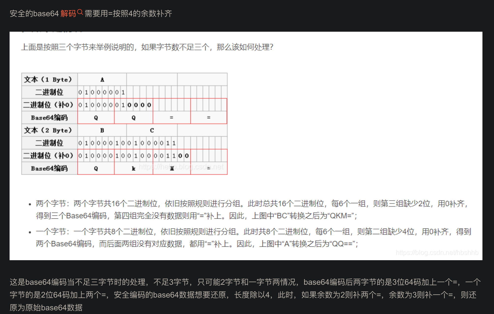

```
Base64编码要求把3个8位字节（3*8=24）转化为4个6位的字节（4*6=24），之后在6位的前面补两个0，形成8位一个字节的形式。 如果剩下的字符不足3个字节，则用0填充，输出字符使用‘=’，因此编码后输出的文本末尾可能会出现1或2个‘=’。

为了保证所输出的编码位可读字符，Base64制定了一个编码表，以便进行统一转换。编码表的大小为2^6=64，这也是Base64名称的由来。

Base64编码表

码值	字符	码值	字符	码值	字符	码值	字符	码值	字符	码值	字符	码值	字符	码值	字符
0	A	8	I	16	Q	24	Y	32	g	40	o	48	w	56	4
1	B	9	J	17	R	25	Z	33	h	41	p	49	x	57	5
2	C	10	K	18	S	26	a	34	i	42	q	50	y	58	6
3	D	11	L	19	T	27	b	35	j	43	r	51	z	59	7
4	E	12	M	20	U	28	c	36	k	44	s	52	0	60	8
5	F	13	N	21	V	29	d	37	l	45	t	53	1	61	9
6	G	14	O	22	W	30	e	38	m	46	u	54	2	62	+
7	H	15	P	23	X	31	f	39	n	47	v	55	3	63	/
```

- 在线工具查阅：http://tools.jb51.net/tools/base64_decode-gb2312.php
- GB2312简体中文编码表:http://tools.jb51.net/table/gb2312
- https://blog.csdn.net/jinglong512741/article/details/117443804
- https://blog.csdn.net/key_world/article/details/109603600
- https://php-note.com/article/1437.html
- https://blog.csdn.net/xqhrs232/article/details/78133087
- https://www.ruanyifeng.com/blog/2007/10/ascii_unicode_and_utf-8.html
- https://juejin.cn/post/6844904040090828814

